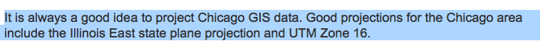

# (PART\*) GIS and Spatial Data {-}

# Introduction to Spatial Data

## Learning Objectives

- Understand the difference between vector and raster data
- Describe the components of a PROJ4 string
- Name the two main packages for spatial vector data in R
- Import, project, and plot spatial data in R

## Spatial Data Basics

We first reviewed some important information about spatial data. The two main types are 
**vector** (points, lines, polygons) and **raster** (pixels, surfaces). Since this workshop is given in the context of social science research, the rest of our workshop focuses on [vector data](https://datacarpentry.org/organization-geospatial/02-intro-vector-data/index.html) such as administrative boundaries, locations of business, or road networks.

Next, we went over what a **coordinate reference system** was, as well as the components of a **PROJ4 string**, or how coordinate reference systems are stored electronically. Rather than writing out the whole PROJ4 string, we can use an **EPSG code** as shorthand for it. This [Software Carpentry workshop](https://datacarpentry.org/organization-geospatial/03-crs/index.html) provides excellent explanations and exercises for understanding coordinate reference systems.

Finally, we learned that [`sf`](https://r-spatial.github.io/sf/index.html) is the modern package for handling spatial data in R. Some old packages still use `sp`. However, it has a much more complicated representation of spatial data, so we will focus on `sf`. See [this guide](https://github.com/r-spatial/sf/wiki/Migrating) for a translation of `sp` to `sf` commands, if you're used to using `sp`.

## Interactive Tutorial

The rest of the workshop was dedicated to a hands-on exercise where we live coded together. The data we used was 1986 Chicago aldermanic ward boundary data, which can be found on the UChicago Map Collection page [here](https://www.lib.uchicago.edu/e/collections/maps/chigis.html).

```{block type="rmdinfo"}
This workshop's script can be found [here](https://github.com/spatialanalysis/workshop-scripts/blob/master/R/01-intro.R).
```

### Functions learned

- `st_read()`
- `st_crs()`
- `st_transform()`

### Import spatial data

The first thing we'll do is import the spatial data. Our spatial data happens to be stored as a shapefile (.shp, but actually 4 files). These are getting less fashionable (see [GeoJSON](http://geojson.org/), etc.), but a lot of spatial data is still stored this way.

First load the `sf` library. If you don't have it, install it in your console or in the Packages RStudio pane.
```{r}
# install.packages("sf")
library(sf)
```

We'll use the `st_read` function. This also reads GeoJSON, PostGIS databases, and more. 

```{r}
ward86 <- st_read("data/ward1986.shp")
```
```{block type="rmdinfo"}
You can use the keyboard shortcut `Ctrl-Enter` to run a line of code in R.
```

```{block type="rmdinfo"}
Press tab after typing in `st_read("")` with your cursor in between the quotation marks and you'll get a nice autocomplete feature.
```

Check what projection the data is in:
```{r}
st_crs(ward86)
```
Sike, this isn't projected! You can tell because the proj4string starts with `+proj=longlat`. You can still plot this, but things will start to get iffy if you try to do distance or area calculations, or plot these ward boundaries with other layers.

I can still plot the map, but as a good geographic data analyst, I'll need to project it.
```{r}
plot(ward86)
```

### Project your data

We need to project the data: but how do we choose what projection we need? This is a deep philosophical question, but thankfully the UChicago library has [already told us](https://www.lib.uchicago.edu/e/collections/maps/chigis.html) the best projections to use for our data: *Illinois East State Plane* or *UTM Zone 16*.



```{block type="rmdinfo"}
I generally do a online search to look up the EPSG codes for the projection I want to use, or use [spatialreference.org](http://spatialreference.org/ ), which has a database for all EPSG codes for projections.
```

After I do some sleuthing, I find that the EPSG code I want for UTM Zone 16 is `32616`. I then use `st_transform()` to project the data, and save it as a new `sf` dataframe.
```{r}
ward86_utm <- st_transform(ward86, 32616)
```

I check the CRS - yep, looks right!
```{r}
st_crs(ward86_utm)
```

```{block type="learncheck"}
**Challenge**
```
Question: what datum is this in? What are the units for this projection?

```{block type="learncheck"}
```

Plot it:
```{r}
plot(ward86_utm)
```

```{block type="learncheck"}
**Challenge**
```
- Project the 1986 ward data into the Illinois East State plane projection. Follow the above steps to do so. Hint: look up the EPSG code online!

```{block type="learncheck"}
```

```{r}
ward86_stateplane <- st_transform(ward86, 3435)
st_crs(ward86_stateplane)
plot(ward86_stateplane)
```

Note that the `+units=us-ft` part of the proj4string means that any distance calculations you do on the `ward86_stateplane` data will be done in feet.

```{block type="rmdwarning"}
Keep in mind that there are "bad" projections for your data. For example, if I accidentally chose the Alaska Albers projection for my data...
```{r}
ward86_alaska <- st_transform(ward86, 3338)
plot(ward86_alaska)
```

Clearly this projection isn't great for Chicago! But something to keep in mind, if, say, you're making maps of places closer to the poles.
```

## Links

All the links in this workshop:

- Software Carpentry Vector Data tutorial: https://datacarpentry.org/organization-geospatial/02-intro-vector-data/index.html
- Software Carpentry CRS tutorial: https://datacarpentry.org/organization-geospatial/03-crs/index.html
- `sf` reference site: https://r-spatial.github.io/sf/index.html
- Migrating from sp to sf guide: https://github.com/r-spatial/sf/wiki/Migrating
- GeoJSON explanation: http://geojson.org/
- Chicago ward data: https://www.lib.uchicago.edu/e/collections/maps/chigis.html
- Link to good EPSG lookup website: http://spatialreference.org/ 
