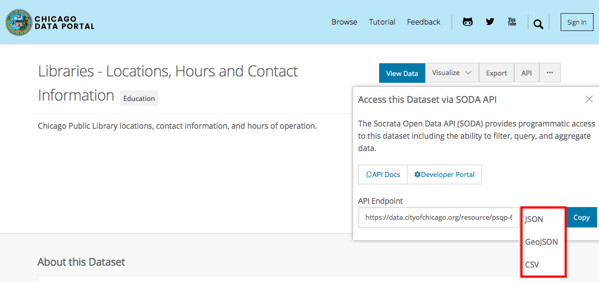

# Multiple-Dataset GIS Operations / Visualization pt. 2

## Learning Objectives

- Combine two datasets with spatial join
- Perform spatial aggregation (point in polygon)
- Manipulate data with dplyr
- Save a ggplot image

## Functions Learned

- `st_join()`
- `select()`
- `count()`
- `arrange()`
- `st_geometry()`
- `ggsave()`

```{block type="rmdinfo"}
Hint: For each new function we go over, type `?` in front of it in the console to pull up the help page.
```

## Interactive Tutorial

```{block type="rmdinfo"}
This workshop's script can be found [here](https://github.com/spatialanalysis/workshop-scripts/blob/master/R/04-gis-3.R).
```

## Challenges

We've been reading shapefiles that we've downloaded, but we call also read data directly from a website using an "API". These are often great ways to get data without having to manually download it.

We're going to read data from the Chicago Data Portal:

- [Libraries](https://data.cityofchicago.org/Education/Libraries-Locations-Hours-and-Contact-Information/x8fc-8rcq) points
- [Community Area](https://data.cityofchicago.org/Facilities-Geographic-Boundaries/Boundaries-Community-Areas-current-/cauq-8yn6) polygons

Click on the "API" button to directly access the data, rather than having to download a csv via "Export".

```{block type="learncheck"}
**Challenge**
```
0. Which one of these is a geographic data format?


```{block type="learncheck"}
```


```{block type="learncheck"}
**Challenge**
```
1. Fill in the following script:
```{r}
# Load libraries for use

areas <- st_read("https://data.cityofchicago.org/resource/igwz-8jzy.geojson")

# Read in libraries and areas data


# Project both


# Make a ggplot with libraries and community areas


```
```{block type="learncheck"}
```


```{block type="learncheck"}
**Challenge**
```
2. Which community areas have no libraries? Use `st_intersects` and `filter` to make a map.
```{r}
# Load library with filter() in it


# Find which areas intersect with libraries and save as a variable called "intersects"


# Filter areas by *without* libraries. Save as a variable called "no_lib" Hint: use "==" instead of ">" in the logical comparison


# Make a ggplot with libraries, community areas, and community areas without libraries


```
```{block type="learncheck"}
```

```{block type="rmdwarning"}
The order in which you give arguments to `st_intersects` matters! I always have to look it up, but for point-in-polygon, you want the polygon first, then the points.
```

One question you may be asking yourself is, how many libraries are in each area?

We can tackle this with an operation known as a *spatial join*. What we do is join information about the polygons to the points, so we have for each point which community area it's in. More formally, we are adding the attributes of a layer to the other one.

```{block type="rmdwarning"}
A **spatial join** is not the same as an **attribute join**, which is based on common column (attribute) values between two datasets. Spatial joins are based on a *spatial relationship*: is this point inside this polygon?
```

The syntax is generally as follows, for point-in-polygon:

> `st_join(point_sf, poly_sf)`

### A simple example


We can spatial join just one attribute, or a few. We can use `select()` to choose attributes.

One we've done our spatial join, we can manipulate the data with `count()` and `arrange()` to figure out which community areas have the most libraries. This is also known as spatial aggregation.

If work with the spatial data gets too clumsy or slow, we can drop the geometry column with `st_geometry()<-`.

### Saving your plots

We ran out of time for this last time, but to save a ggplot image, you can use `ggsave()` after a ggplot2 command. You can adjust the width and height of the image in arguments to the function.

```{block type="learncheck"}
**Challenge**
```
Save one of the plots we've made in this workshop to `figs/name-of-plot.png`.
```{block type="learncheck"}
```

## Links
All the links in this workshop:

- Link to Chicago Libraries data: https://data.cityofchicago.org/Parks-Recreation/Waterways/eg9f-z3t6
- Link to Chicago Community Areas data: https://data.cityofchicago.org/Facilities-Geographic-Boundaries/Boundaries-Community-Areas-current-/cauq-8yn6
