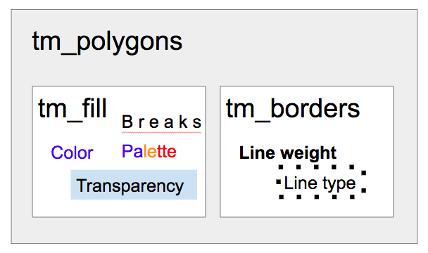

# Basic Mapping

## Outline of Today's Workshop

We'll be doing the following few things:

1. finishing up [Spatial Data Handling](https://spatialanalysis.github.io/lab_tutorials/1_R_Spatial_Data_Handling.html)

2. discussing finding open-source geospatial data,

3. then working from this [Basic Mapping lab tutorial](https://spatialanalysis.github.io/lab_tutorials/4_R_Mapping.html).

## Spatial Data Handling, fin

There's a long section in the tutorial about PDF scraping. If you've already done it, sorry! I just put together a [data package](https://spatialanalysis.github.io/geodaData/) that you can install to use with these tutorials.

Install the package with:

```{r eval=FALSE}
# install.packages("remotes")
remotes::install_github("spatialanalysis/geodaData")
```

Then, you can pull up the community area data *with population attached* with:
```{r eval=FALSE}
library(geodaData)
library(sf)
data("chicago_comm")
```

## Finding Spatial Data

Based on a question from last week, I put together a [list](https://docs.google.com/document/d/12I9nLcBtG8fjxOxCbAt-4ifvMYuIUA0HHDIP7YFBULI/edit) with some sources of spatial data.

```{block type="learncheck"}
**Question**
```
What type of spatial data are you interested in using for your research? Please write down the research question and the type of data you are thinking about using [here](https://docs.google.com/document/d/1v9GkkCspc2tT5-bVi7KrUJgUP8zHuCFfenXHCxyggPk/edit?usp=sharing)!
```{block type="learncheck"}
```

```{block type="learncheck"}
**Question**
```
Where do you think you might be able to find that geospatial data? Take 5 minutes to do a search, discuss with a partner, and jot down your ideas [here](https://docs.google.com/document/d/1v9GkkCspc2tT5-bVi7KrUJgUP8zHuCFfenXHCxyggPk/edit?usp=sharing)!
```{block type="learncheck"}
```

I'm moving to mapping to make sure we cover the necessary spatial concepts, as some of the exploratory data analysis you may have already encountered. We may go back to the multivariate analysis next week, if time.

```{block type="learncheck"}
**Question**
```
How many people feel comfortable with ggplot already? How many people can run a regression in R?
```{block type="learncheck"}
```

## Basic Mapping

We'll start where we left off last week on Basic Mapping. (We're running a bit behind schedule, but thank you for asking good questions!)

To use the NYC boundary data included in the tutorial, run the following code:

```{r}
library(geodaData)
library(sf)
head(nyc_sf)
```

```{block type="learncheck"}
**Question**
```
Take a few minutes and try to understand what the NYC data is about. 

- How many observations and variables are there? What data is stored? (`dim()`, `str()`, `head()`, `summary()`) 
- What does the metadata tell you about this data? (`?nyc_sf`)
- What geometries are in this data? Can you make a quick map with `plot()`?
- What coordinate reference system is there? Is this data projected? (`st_crs()`) Can you Google the EPSG code and figure out what it means? 

```{block type="learncheck"}
```

We'll be working with the tmap R package today. Some resources I find useful for tmap include:

- the tmap [examples](https://github.com/mtennekes/tmap/#reference)
- the [Geocomputation with R](https://geocompr.robinlovelace.net/adv-map.html) site

Load the library:

```{r}
library(tmap)
```

```{r}
tm_shape(nyc_sf) +
  tm_polygons("rent2008")
```

```{block type="learncheck"}
**Question**
```
Try using `tm_fill()` or `tm_borders()` in place of `tm_polygons()`. Can you produce the same thing as `tm_polygons()` with these two functions?
```{block type="learncheck"}
```

There are multiple ways to do the same thing in R!

In this case, `tm_polygons()` is a superset of `tm_fill()` and `tm_borders()`.



### Adding a basemap

If you want a basemap for your map, change the `tmap_mode` to "view".

```{r}
tmap_mode("view")

tm_shape(nyc_sf) +
  tm_polygons("rent2008")
```


Want a prettier basemap? R can connect to other map servers. You can preview basemaps and find their names at this [Leaflet Provider Demo](https://leaflet-extras.github.io/leaflet-providers/preview/). You can also pull up a list of all the providers with `leaflet::providers`.

```{r}
tm_shape(nyc_sf) + 
  tm_polygons("rent2008") +
  tm_basemap(server = "OpenStreetMap")
```

### Customizing tmap function parameters

Each `tm_` function has arguments you can set to other things. This allows you to change the color, the transparency, the outlines, the labels, and more. All this customization is very powerful!

```{block type="learncheck"}
**Question**
```
Can you look up the help documentation of `tm_polygons` with `?tm_polygons`? Which parameter controls transparency? How would you change the title of the legend to something else?
```{block type="learncheck"}
```

I can't teach you everything in a workshop, so the best thing I can leave you with is an ability to poke through R documentation to find what you need.

### Adding a histogram

Certain functionalities are only available in plotting mode, like adding a histogram of the data:

```{r}
tmap_mode("plot")

tm_shape(nyc_sf) + 
  tm_polygons("rent2008", legend.hist = TRUE)
```

### Getting our map ready for production

In order to do our final tweaking, we need to do things to the map as a whole. In this case, we'll use `tm_layout()`, as we're not working on one specific aspect of the map.

```{block type="learncheck"}
**Question**
```
Look up `tm_layout()` in the R documentation. (Get ready to be overwhelmed by the options.) What other customizations exist?
```{block type="learncheck"}
```

We can add a title with `title =`. 

```{r}
tm_shape(nyc_sf) + 
  tm_polygons("rent2008", legend.hist = TRUE) +
  tm_layout(title = "Rent 2008 NYC Sub-Boroughs")
```

A schematic to clarify how this works:


```{block type="learncheck"}
**Question**
```
Try some of the following changes:

- Add a compass and a scale bar
- Move the legend outside
- Move the title outside and center it (try `main.title()`)

```{block type="learncheck"}
```

### Using Examples

It's sometimes easier to look for examples, and replicate that code than digging through the documentation.

```{block type="learncheck"}
**Question**
```
Can you try to replicate one of the map styles in the tmap examples (here's the [code used to create them](https://cran.r-project.org/web/packages/tmap/vignettes/tmap-JSS-code.html)), using the NYC data we just worked with? Take a few minutes and try it out!
```{block type="learncheck"}
```

