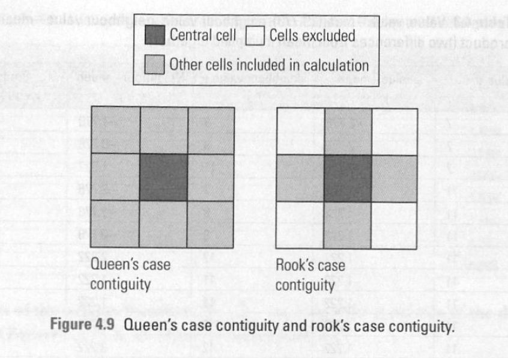
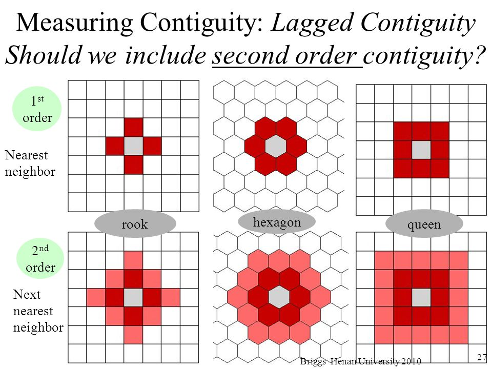
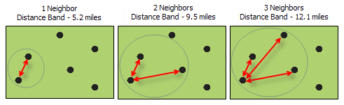

# Spatial Autocorrelation

## Install packages

Make sure you have the **spdep** package installed:

```{r eval=FALSE}
install.packages("spdep")
```

I also developed a helper package for some of this spatial autocorrelation stuff, called [**sfExtras**](https://github.com/spatialanalysis/sfExtras). Install with:

```{r eval=FALSE}
# install.packages("remotes")
remotes::install_github("spatialanalysis/sfExtras")
```

## Review from previous workshops

We'll be working with a new dataset, called "ncovr". Go ahead and load it with geodaData:

```{r}
library(geodaData)
library(sf)
head(ncovr)
```

```{block type="learncheck"}
**Question**
```
Take a few minutes and try to understand what this is about. 

- How many observations and variables are there? What data is stored? (`dim()`, `str()`, `head()`, `summary()`) 
- What does the metadata tell you about this data? (`?ncovr`)
- What geometries are in this data? Can you make a quick map with `plot()`?
- What coordinate reference system is there? Is this data projected? (`st_crs()`) 

```{block type="learncheck"}
```

```{block type="learncheck"}
**Question**
```
Try to make a simple map of one of the attributes of interest (homicides, etc) with tmap. Can you make it interactive?

```{block type="learncheck"}
```

## Spatial autocorrelation

We'll start by talking about spatial weights. There are two main types of spatial weights, contiguity and distance based weights.

We'll focus on contiguity today: aka, that a spatial unit shares a border with another spatial unit. We look at **rook** vs. **queen** contiguity.



There's also second order contiguity:



How we define "neighbors" matters when we are trying to determine spatial autocorrelation.

## Do it in R

Load two more libraries:

```{r message=FALSE, warning=FALSE}
library(sfExtras)
library(spdep)
```

We'll be using the following functions (potentially buggy):

```{r eval=FALSE}
?st_rook
?st_queen
?st_as_nb
?st_centroid_coords # for mapping the weights
```

The code we wrote last week to calculate weights:

```{r}
library(tmap)
tm_shape(ncovr) +
  tm_polygons("HR60")

ncovr_rook <- st_rook(ncovr)
ncovr_queen <- st_queen(ncovr)

# check average number of neighbors per county
rook_neighbors <- lengths(ncovr_rook)
queen_neighbors <- lengths(ncovr_queen)

mean(rook_neighbors) # 5.6 ish
mean(queen_neighbors) # 5.8 ish
 
# convert lists of neighbors to "nb" object to make map
rook_nb <- st_as_nb(ncovr_rook)
summary(rook_nb)

queen_nb <- st_as_nb(ncovr_queen)
summary(queen_nb)

centroid_coords <- st_centroid_coords(ncovr)

plot(queen_nb, centroid_coords, lwd = 0.2, cex = 0.5, col = "blue")
```

## Second order contiguity weights

## Distance-Band Spatial Weights

To match the [GeoDa documentation](https://geodacenter.github.io/workbook/4b_dist_weights/lab4b.html), we'll be using a dataset called "clev_pts". Go ahead and load it with geodaData (if you can't, you can download it from the [Data and Lab website](https://geodacenter.github.io/data-and-lab//clev_sls_154_core/)):

```{r}
library(geodaData)
library(sf)
head(clev_pts)
```

```{block type="learncheck"}
**Question**
```
Take a few minutes and try to understand what this is about. 

- How many observations and variables are there? What data is stored? (`dim()`, `str()`, `head()`, `summary()`) 
- What does the metadata tell you about this data? (`?clev_pts`)
- What geometries are in this data? Can you make a quick map with `plot()`?
- What coordinate reference system is there? Is this data projected? (`st_crs()`) 

```{block type="learncheck"}
```

```{block type="learncheck"}
**Question**
```
Try to make a simple map of one of the attributes of interest (homicides, etc) with tmap. Can you make it interactive?

```{block type="learncheck"}
```

There are two ways to go about doing distance-based spatial weights, as mentioned in the GeoDa documentation:

1. Determine a distance band under which something is considered a neighbor (see below)
2. Determine the number of neighbors each point should have (distances will vary)



We'll start with the first.

```{r}
?dnearneigh
```

Let's specify a bandwidth of 1000.

```{r}
dnearneigh(clev_pts, 0, 1000)
```

```{block type="learncheck"}
**Question**
```
What units does "1000" refer to? (Hint: check with `st_crs`!)

```{block type="learncheck"}
```

We can plot this to get a sense of what's going on. Remember, the syntax for `plot()` is `plot(nb, coord_matrix, options)`.
```{r}
dist_1000_nb <- dnearneigh(clev_pts, 0, 1000)
plot(dist_1000_nb, st_coordinates(clev_pts), lwd=.2, col="blue", cex = .5)
```

Notice how a lot of points are missing neighbors? They're referred to as "isolates".

Maybe we want to specify a minimum distance so that each point has a neighbor. This is referred to as the **critical threshold**.

If we want each point to have one neighbor, we can use `knearneigh`. This (older function) takes in a matrix and returns a matrix, so we need to convert formats.

```{r}
knn_matrix <- knearneigh(st_coordinates(clev_pts))
```

To convert this matrix into a familiar **nb**, we use knn2nb:

```{r}
knn2nb(knn_matrix)
```

Now when we plot again, we see each point has a neighbor:

```{r}
k1_nb <- knn2nb(knn_matrix)
plot(k1_nb, st_coordinates(clev_pts), lwd=.2, col="blue", cex = .5)
```

Each point has exactly one neighbor here. 

```{block type="learncheck"}
**Question**
```
Can you set it so that each point has 6 neighbors? Plot it!
```{block type="learncheck"}
```

Now let's try doing something different: setting the distance band equal to the critical threshold in `dnearneigh()`.

The `nbdists` function will give us the distance between a point and its closest neighbor. 

```{r eval=FALSE}
nbdists(k1_nb, st_coordinates(clev_pts))
```

```{block type="learncheck"}
**Question**
```
Can you find the maximum distance in this list and assign it to a variable called `critical_thres`? Can you put it into the `dnearneigh` function and plot a map where we have a fixed distance band of the critical threshold?
```{block type="learncheck"}
```

## Connectivity histograms

When doing distance band weights, points have different numbers of neighbors, unlike in k-nearest weights. Let's get the **cardinality** (aka number of neighbors) for each observation

```{r echo=FALSE}
critical_threshold <- 3598.055
dist_crit_nb <- dnearneigh(st_coordinates(clev_pts), 0, critical_threshold)
```

```{r}
card(dist_crit_nb)
```

```{block type="learncheck"}
**Question**
```
What's the most common number of neighbors? Try making a ggplot histogram out of this, too.
```{block type="learncheck"}
```


